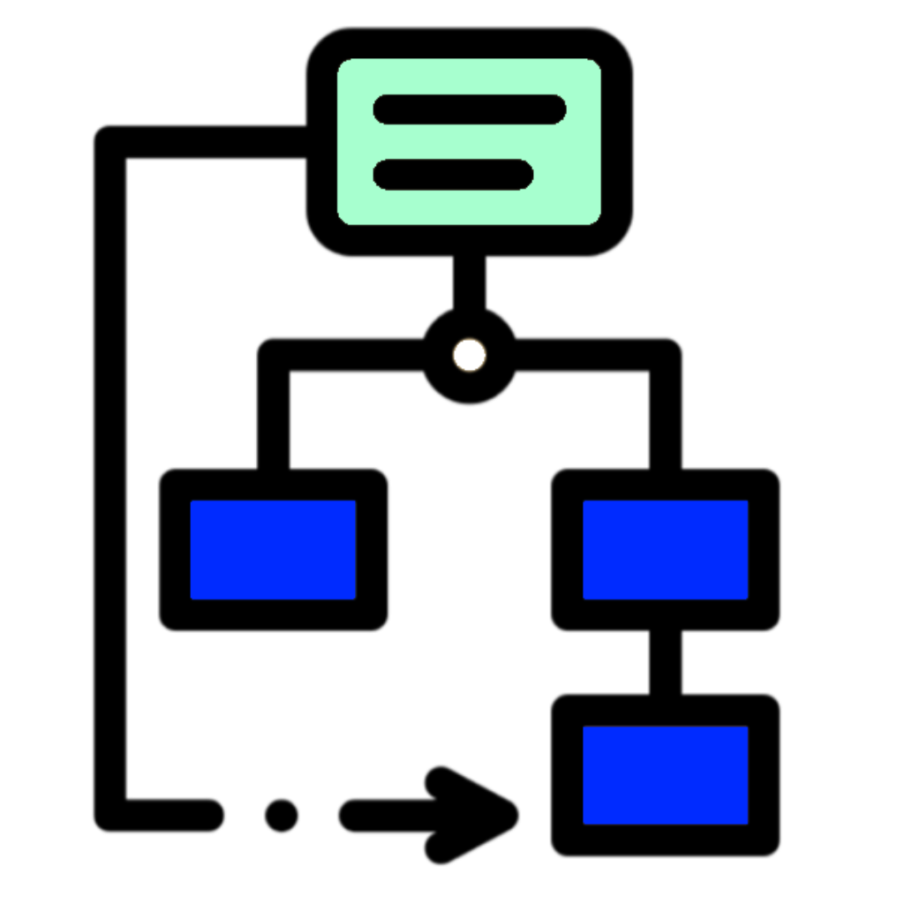

<h4 align="Center">1SY - Analyse Objet</h4>

# 🏋🏻‍♂️ Exercices 01 - UCD

#### 📁 [Structure à utiliser](../includes/rules.md)

## ⛽ Question 01 - James le pompiste

Considérons une station-service de distribution d'essence. Les clients se servent de l'essence et le camionneur-pompiste remplit les cuves.

1. Le client se sert de l'essence de la façon suivante : il prend un pistolet accroché à une pompe et appuie sur la gâchette pour prendre de l'essence. Qui est l'acteur du système ? Est-ce le client, le pistolet ou la gâchette et pourquoi ?
2. James, dont le métier est pompiste, peut se servir de l'essence pour sa voiture. Pour modéliser cette activité de James, doit-on définir un nouvel acteur ? Comment modélise-t-on ça en PlantUML ?
3. Lorsque James vient avec son camion-citerne pour remplir les réservoirs des pompes, est-il considéré comme un nouvel acteur ? Comment modélise-t-on cela ?
4. Certains pompistes sont aussi qualifiés pour opérer des opérations de maintenance en plus des opérations habituelles des pompistes telles que le remplissage des réservoirs. Ils sont donc réparateurs en plus d'être pompistes. Comment modéliser cela ?

## 🧾 Question 02 - Shamazon
Considérez les besoins suivants :
- Passer une commande (parfois urgente).
- Authentifier.
- Expédier une commande.

Passer une commande urgente est un cas particulier de passer une commande. Pour passer une commande, il faut nécessairement authentifier l'utilisateur.

Codez le diagramme de cas d'utilisation associé en y ajoutant un acteur principal.

## 📦 Question 03 - P.O.S.
Programmez le diagramme de cas d'utilisation du système `Alkatrak` de vente suitant :

1.	Un client arrive à la caisse avec des articles.
2.	Le caissier enregistre le numéro d'identification de chaque article, ainsi que la quantité si celle-ci est supérieure à 1.
3.	La caisse affiche le prix de chaque article et son libellé.
4.	Lorsque tous les articles ont été enregistrés, le caissier signale la fin de la vente.
5.	La caisse affiche le total des achats.
6.	Le client choisit son mode de paiement :
- Liquide : le caissier encaisse l'argent et la caisse indique le montant éventuel à rendre au client.
- Chèque : le caissier note l'identité du client et la caisse enregistre le montant sur le chèque.
- Carte de crédit : un terminal bancaire fait partie de la caisse, il transmet la demande à un centre d'autorisation multi-banques.
7.	La caisse enregistre la vente et imprime un ticket.
8.	Le caissier transmet le ticket imprimé au client.
9.	Un client peut présenter des coupons de réduction avant le paiement. Lorsque le paiement est terminé, la caisse transmet les informations relatives aux articles vendus au système de gestion des stocks. Tous les matins, le responsable du magasin initialise les caisses pour la journée.

## 🚗 Question 04 - RentIt
Programmez le diagramme des cas d'utilisation de l'énoncé suivant :

RentIT, une jeune entreprise œuvrant dans la location de véhicules souhaite informatiser ses opérations en créant un système basé sur les technologies web.

Un client peut consulter le site web afin de vérifier l’ensemble des véhicules. Il pourra en effectuer la réservation dans la mesure où il accepte de devenir membre ce qui implique de s’enregistrer au système en fournissant ses coordonnées, ses informations personnelles incluant la date de naissance ainsi qu’un numéro de carte de crédit valide (obligatoire pour les réservations par internet).

Un membre qui désire réserver un véhicule devra avoir 500$ de crédit de libre sur sa carte de crédit, montant qui sera débloqué à son retour.  Il choisira ensuite une succursale, date et l’heure de prise de possession et de retour.  RentIT présentera alors la liste des véhicules disponibles (non réservés) selon le groupe d’âge.

Il faut un minimum de 18 ans afin de louer un véhicule compact.  Pour les berlines, l’âge passe à 21 ans et à 25 ans pour les véhicules de luxe.

Quand un client/membre se présente au comptoir pour prendre possession d’un véhicule, il est accueilli par un préposé à la location qui s’occupe de préparer le véhicule pour la location.  Il notera le km du véhicule, son niveau d’essence et prendra des photos de l’état initial du véhicule pour enfin procéder au paiement soit en argent, par débit (après autorisation de l’institution financière) ou par carte de crédit après confirmation du SAC (système d’autorisation de crédit).

Il effectuera les mêmes opérations lors du retour du véhicule mais pourra, au besoin, réclamer des frais de location supplémentaires le cas échéant (dépassement du km, dommages, pleins d’essence non fait).

La liste des véhicules disponible à la location est gérée par le gérant qui œuvre dans l’entreprise au même titre qu’un préposé à la location.

Seuls les clients peuvent utiliser le système sans être authentifiés.

