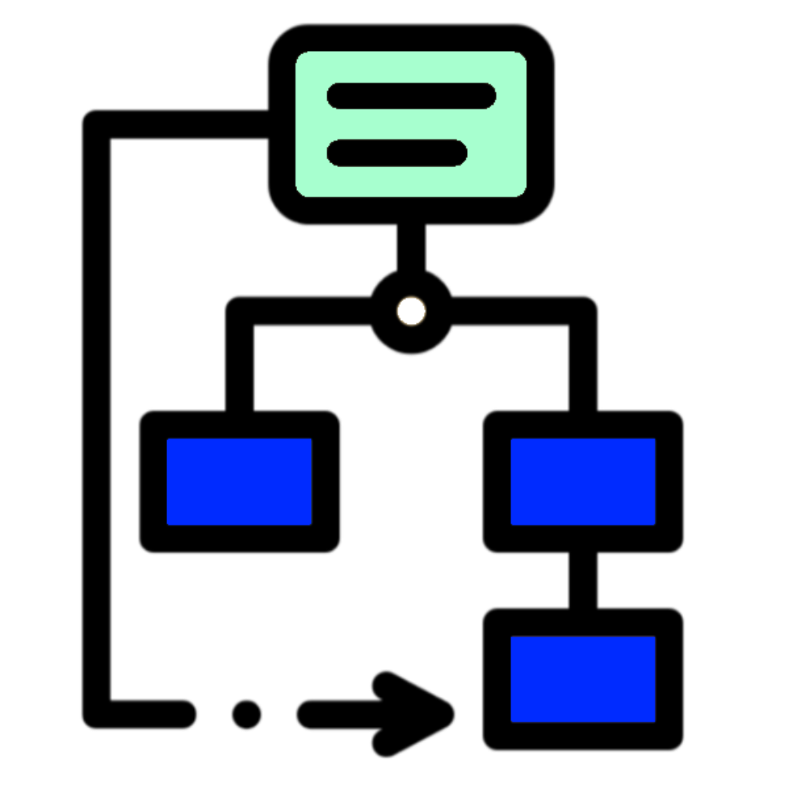

<h4 align="Center">1SY - Analyse Objet</h4>

# 🏋🏻‍♂️ Projet #2 - ShawiQuest I (25%)

### Développement d'une simulation RPG avec patterns 

## Mise en situation

Notre cher ami Yvan Dusoft a réussi à vendre vos services de développement de jeux à un client afin de programmer un RPG complet.  
Il vous demande de lui présenter une simulation automatisée de deux joueurs qui s'affrontent avec des armes et des défenses de toutes sortes.

Vous ne voudrez pas recommencer tout le code quand Yvan vous demandera de programmer le vrai jeu, alors vous êtes assez sage pour utiliser les *Design Patterns*.  

De plus, après le développement de la simulation, Yvan souhaiterait que vous expliquiez votre code à Cédrik en détaillant les patterns utilisés.

Yvan vous demande d'utiliser votre passion afin de réaliser un jeu des plus créatifs...

## Critères du projet

La simulation, présentée en mode console, devra pouvoir s'exécuter automatiquement pendant une durée aléatoire de 20 à 40 secondes. Elle devra se relancer quand le client appuiera sur la barre d'espacement.

Les deux joueurs fictifs s’affronteront à tour de rôle, en utilisant à chaque fois des armes et des défenses différentes, causant ainsi des dégâts variables, jusqu’à ce que la ligne de vie de l’un d’eux tombe à zéro.  La classe `GameOverManager` s'occupera de terminer la simulation, le cas échéant.

Vous devrez obligatoirement utiliser le design pattern *Singleton* afin d’ajouter des **propriétés au système** (exemple: ratio de force de frappe, temps d'attente entre les attaques, etc...) (selon votre créativité) et deux des trois autres patterns pour programmer le reste de la simulation.

### Patterns à utiliser :
- Singleton (mode lazy).

#### Choisir 2 dans ces 3 patterns :
- [Observer](http://bin.cshawi.info/2025/1SY/ShawiQuest(Observer).zip).
- [Decorator](https://slides.com/hkoncept/a25-1sy-08/fullscreen?token=xtffuPUv).
- [Strategy](https://slides.com/hkoncept/a25-1sy-09/fullscreen?token=6jDRLDhm).

## Grille d'auto correction

| #   | Critère                                    | Pts |
| --- | ------------------------------------------ | --- |
| 01  | Utilisation juste du pattern Singleton     | 2   |
| 02  | Utilisation juste du pattern #2            | 4   |
| 03  | Utilisation juste du pattern #3            | 4   |
| 04  | Respect des principes orientés-objet       | 3   |
| 05  | Respect des critères et des demandes       | 2   |
| 06  | Explications claires des patterns utilisés | 10 |
| P   | Retard dans la remise (par jour)           | -10% |
|    | **TOTAL**           | **25** |
| B  | Utilisation juste du pattern #3 (bonus) | 1 |

